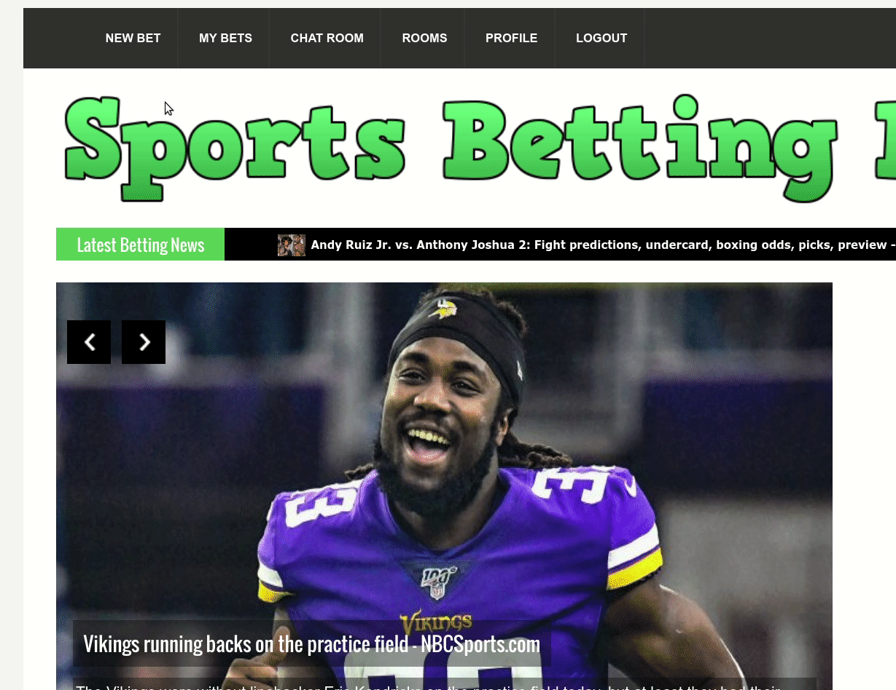
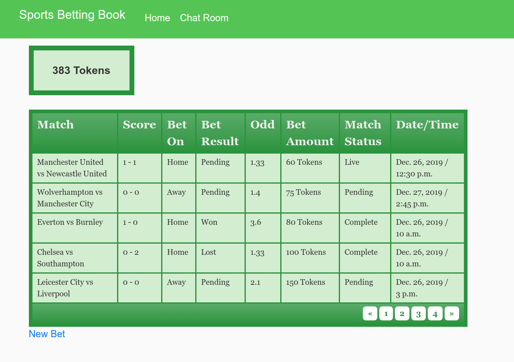
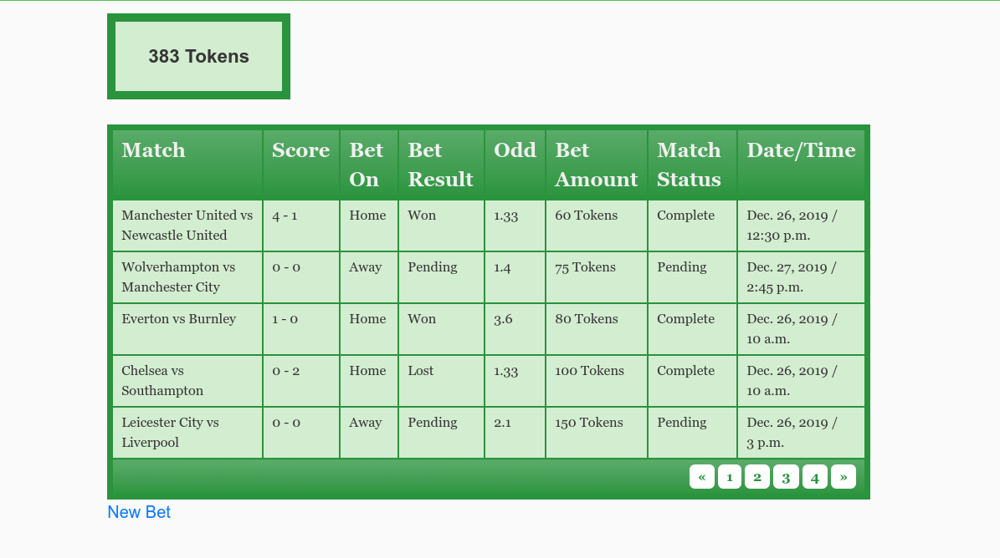
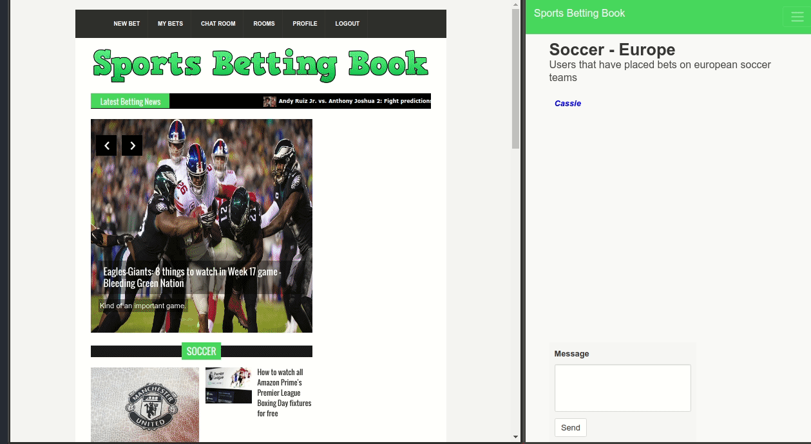

# Open Source Betting Platform
**Selected prototyped parts of the Sports Betting Book platform are currently open sourced**
 
 
**If you would like to learn more about our full-development platform or need guidance with software related issues, please contact nyle.dharani@gmail.com for questions and concerns**
 
## Technologies Used
- Python Backend with Django Framework
- ODDS and THESPORTSDB API's
- Microsoft's Cognitive API
- ESPN NEWS API
- Celery
- Twilio
- JQuery
## Demo

The Betting Platform's front-page is a newsfeed. It's based on popular bets, top news from ESPN NEWS API, popular predicition articles, and sports categories. (Soccer, Football, Hockey, Basketball) 

You can bet from different sports groups and leagues within each group. Select a match, choose a team to bet on and amount of tokens you want to bet. Your bet will be added to your "My Bets Table". 

You might've noticed that the Manchester vs Newcastle game was live, all Odds get updated every 2 hours with Celery. This is provided by the ODDS API https://the-odds-api.com/liveapi/guides/v3/, 500 free requests a month. Based on bet outcomes, the table automatically updates, and user balances get updated. 

   

All matches are updated every hour with Celery, using the THESPORTSDB API https://www.thesportsdb.com/api/, which is free! When betting, matches automatically are removed from selection once they go live and new ones take thier place. Max 10 are displayed. 

 
 

Players also get to chat in rooms. There is one room per group seen

Players also get a personal profile with thier information. We have also added a cool face-verfication feature. 

Authentication

**Please feel free to play with code, add new features, and learn from existing code**

